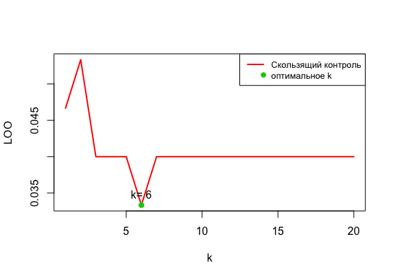

# Метрические алгоритмы классификации

Метрические классификаторы опираются на гипотезу компактности, которая предполагает, что схожие объекты чаще лежат в одном классе, чем в разных. Для формализации понятия сходства вводится функция расстояния между объектами.

## Алгоритм k ближайших соседей – **kNN**

Пусть задана обучающая выборка пар «объект-ответ» 

Пусть на множестве объектов задана функция расстояния  . Эта функция должна быть достаточно адекватной моделью сходства объектов. Чем больше значение этой функции, тем менее схожими являются два объекта (x,x'). 

Для произвольного объекта u расположим объекты обучающей выборки  в порядке возрастания расстояний до u:

,

где через  обозначается тот объект обучающей выборки, который является i-м соседом объекта u. 

Алгоритм ближайших соседей в общем виде:


 - весовая функция.

Для kNN    


### Выбор данных

Выборка состоит из 150 экземпляров ирисов трех видов, имеет четыре характеристики: длина и ширина чашелистика (`Sepal.Length` и `Sepal.Width`), длина и ширина лепестка (`Petal.Length` и `Petal.Width`)


### Евклидово расстояние


```R
euclideanDistance <- function(u, v) {
 sqrt(sum((u - v)^2))
}
```
### Функция kNN

Для классификации каждого из объектов тестовой выборки необходимо последовательно выполнить следующие операции:
* Вычислить расстояние до каждого из объектов обучающей выборки
* Отобрать k объектов обучающей выборки, расстояние до которых минимально
* Класс классифицируемого объекта — это класс, наиболее часто встречающийся среди k ближайших соседей

**Пример:**
```
kNN(train = trainIris, test = testIris, cl = trainIris$Species, k = 3)
```

**Аргументы:**

`train` - обучающая выборка

`test` - контрольная выборка

`cl` - ответы (идентификаторы классов) обучающей выборки

`k` - колличество ближайших соседей, которое используется

Возвращает предсказания на тестовой выборке

### Критерий скользящего контроля LOO для kNN

Оптимальное в смысле точности предсказаний значение  `k`  может быть найдено с использованием перекрестной проверки. Для этого по фиксированному значению  `k`  строится модель  `k` -ближайших соседей и оценивается ошибка классификации. Эти действия повторяются для различных  `k`  и значение, соответствующее наименьшей ошибке распознавания, принимается как оптимальное.



### Карта	классификации kNN


---

## Алгоритм	k взвешенных	ближайших	соседей	– **kwNN**

i-му соседу объекта u приписывается вес , как правило, убывающий с ростом ранга соседа i. Объект относится к тому классу, который набирает больший суммарный вес среди k ближайших соседей.

Выберем следующую функцию веса 
 
### Критерий	скользящего	контроля	LOO для kwNN


### Карта	классификации	kwNN


---

## Сравнение	качества	алгоритмов	kNN и	kwNN.

kNN — один из простейших алгоритмов классификации, поэтому на реальных задачах он зачастую оказывается неэффективным. Помимо точности классификации, проблемой этого классификатора является скорость классификации: если в обучающей выборке N объектов, в тестовой выборе M объектов, а размерность пространства — K, то количество операций для классификации тестовой выборки может быть оценено как O(K*M*N). 

kwNN отличается от kNN, тем что учитывает порядок соседей классифицируемого объекта, улчшая качество классификации.

## Пример,	показывающий	преимущество	метода kwNN над kNN.
	
Недостаток kNN в том, что максимальная сумма голосов может достигаться на нескольких классах одновременно.
В задачах с двумя классами этого можно избежать, если брать только нечётные значения k. Более общая тактика, которая годится и для случая многих классов — ввести строго убывающую последовательность вещественных весов, задающих вклад i-го соседа в классификацию.

## Метод парзеновского окна

Для оценки близости объекта u к классу y алгоритм использует следующую функцию:

 , где  — функция ядра.

Чаще всего применяются 5 типов ядер:

 Прямоугольное 
 Треугольное 
Квартическое 
Епанечниково 
Гауссовское (нормальное распределение)

### Карта	классификации	PW 
Гауссовское ядро:


### Плюсы:

* прост в реализации
* хорошее качество классификации при правильно подобраном h
* все точки с одинаковым расстоянием будут учитаны
* классификация точки занимает  , так как не требует сортировки

### Минусы:

* необходимо хранить всю выборку целиком
* бедный набор параметров
* в случае одинаковых весов классов алгоритм выбирает любой (однако стоит заметить, что эти случаи будут встречаться редко)
* диапазон параметра h необходимо подбирать самостоятельно, учитывая плотность расположения точек
* если ни одна точка не попала в радиус h, алгоритм не способен ее классифицировать (не актуально для гауссовского ядра)

## STOLP

Отступом (margin) объекта  относительно алгоритма классифи-
кации, имеющего вид , называется величина
.

Отступ показывает степень типичности объекта. Отступ отрицателен тогда
и только тогда, когда алгоритм допускает ошибку на данном объекте.
В зависимости от значений отступа обучающие объекты условно делятся на
пять типов, в порядке убывания отступа: эталонные, неинформативные, погранич-
ные, ошибочные, шумовые.

### STOLP для kwNN


